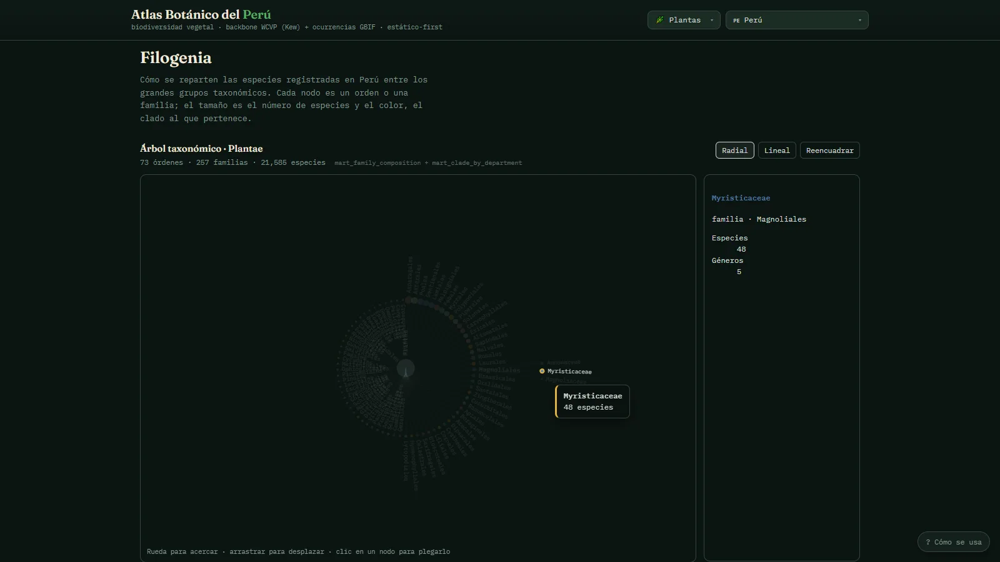

# Atlas Botánico del Perú

A static atlas of Peru's vascular flora and mycobiota, built from open biodiversity data.
21,585 accepted plant species and 1,802 fungal species, mapped across 25 departments, with a
navigable taxonomic tree and per-department richness.

**Everything is computed ahead of time.** A reproducible ETL turns raw downloads into a handful
of small JSON "marts"; the site reads those at build time and ships as plain files. No backend,
no API calls at runtime, no per-visit cost.

## Live demo

**[ichisieben.dev/botanica](https://ichisieben.dev/botanica/)**




## Why it exists

Species checklists and occurrence records live in different places, use different name
authorities, and disagree with each other. The interesting engineering problem is not drawing
charts — it is deciding, defensibly, that two records refer to the same species, and then being
honest about what the resulting numbers can and cannot support.

Two decisions shape every figure on the site:

- **Accepted names only.** Synonyms are resolved against the WCVP backbone before counting, so
  totals are lower than sources that count raw names. That is the point.
- **Occurrence counts measure collection effort as much as biodiversity.** Departments with
  more records are the ones that were sampled more. The site says so where it matters, rather
  than presenting sampling bias as ecology.

## Data sources and licences

| Source | What it provides | Attribution |
|---|---|---|
| **GBIF** | Occurrence records for Peru | Plantae `10.15468/dl.x4m2bc` · Fungi `10.15468/dl.uh7bd4` (CC BY) |
| **WCVP** (Kew) | Accepted-name backbone for vascular plants | [World Checklist of Vascular Plants](https://powo.science.kew.org/about-wcvp) (CC BY 4.0) |
| **Index Fungorum** (Kew, via GBIF Backbone) | Accepted-name backbone for fungi | [indexfungorum.org](https://www.indexfungorum.org) |
| **APG IV** | Order-level classification for flowering plants | Angiosperm Phylogeny Group IV |
| **Open Tree of Life / PAFTOL** | Reference topology (used by `/filogenia/`'s taxonomic view) | [treeoflife.kew.org](https://treeoflife.kew.org) |
| **geoBoundaries** | Department boundaries for the point→department spatial join (PER ADM1) | [geoboundaries.org](https://www.geoboundaries.org) (CC BY 4.0) |

Every GBIF download runs from the project's own GBIF account and is DOI-stamped at download
time, so any figure on the site traces back to an exact, citable extract — see
`docs/licencias/README.md` for the full attribution table and `data/raw/manifest.json` (generated
by the ETL) for the download keys.

## Stack

| Layer | Tool |
|---|---|
| Pipeline | Python 3.11 · DuckDB · `uv` |
| Exports | JSON (versioned) + Parquet (gitignored) |
| Site | Astro 5 · ECharts · zero runtime dependencies |
| Tutorial | `shared/tutorial` — vanilla JS, vendored into `web/public/` |

## Running it — verified steps

Run on Windows with `uv 0.11.23`, Python 3.12, Node 22.14, npm 10.9.

```bash
# 1. Pipeline
uv sync                        # verified: resolves and installs from uv.lock
python -m unittest discover -s tests -v   # verified: 6/6 tests pass, stdlib only

cp .env.example .env           # needs a GBIF account — see below
uv run atlas data              # full pipeline against already-cached raw data
uv run atlas data --full       # re-downloads from GBIF; needs GBIF credentials
```

`uv run atlas data` **needs a GBIF credential in `.env` even without `--full`**: the
`download` stage only skips the network call when raw files are already cached in
`data/raw/`, but every later stage (`match`, `match_fungi`, `aggregate`, `analyze`, `export`,
`profile`) runs against the full cached volume — 1.4M WCVP rows, 1.29M GBIF occurrences. A
fresh clone needs its own free GBIF account (register at [gbif.org](https://www.gbif.org))
before this step will do anything beyond `download`. **Not fully re-verified in this pass**:
`uv run atlas data` was started against this machine's cached `data/raw/` and its local `.env`,
ran for several minutes without erroring, but did not finish inside this session — the ADR-cited
row counts above are consistent with that being genuine processing time, not a hang, but this
README does not claim a completed rerun. The `data/exports/*.json` marts already in the repo
(used by the site build below) are from a prior completed run.

```bash
# 2. Site
cd web
npm install                    # verified: installs clean (npm audit flags pre-existing
                                # advisories in ECharts' dependency tree, no code changes needed)
npm run build                  # verified: -> web/dist/, 4 pages, ~21 s
npm run dev                    # http://localhost:4321
```

The site build reads the already-versioned marts in `data/exports/*.json` — it does **not**
require the pipeline to have just run.

## Structure

```
etl/            10 pipeline stages: download → load → clean → build_apg →
                match → match_fungi → model → aggregate → analyze → export → profile
data/
  raw/          Source downloads (gitignored — regenerated by the ETL)
  atlas.duckdb  Working database (gitignored, ~1 GB)
  exports/      The contract between pipeline and site:
                8 marts as JSON (versioned) + Parquet (gitignored)
web/
  src/pages/    / (Plantae) · /fungi/ · /filogenia/ · /especies/
  src/lib/      data.ts reads the marts with readFileSync at BUILD time
  public/       Static assets + the vendored tutorial
tests/          Unit tests for export ordering
docs/           ADRs, data dictionary, profiling notes, licence table
```

`data/exports/` is the seam. The site never reads the database, only these marts — which is
what makes the published output pure static files.

## Deployment

The site is served from a **subfolder**, not a domain root: `astro.config.mjs` currently sets
`base: '/botanica/'` (and a placeholder `site`), and the kingdom selector navigates through
`import.meta.env.BASE_URL`. The live demo above is served from `ichisieben.dev/botanica/` via
the portfolio hub's deploy pipeline (`Landing/`, a sibling repo) — this repo's own
`astro.config.mjs` is not yet pointed at that domain. Building for a different path means
changing `base` — nothing else hardcodes it.

## Status

Live, tagged "usable" maturity in the portfolio (tier A) as of the last hub update — see the
project card at `ichisieben.dev`. Known gaps below are current, not fixed since.

## Known gaps

Honest ones, not roadmap filler:

- **`mart_described_per_year` is empty.** The description-year curve needs IPNI `published`
  data, fetched on demand to avoid inflating the base download. The chart renders an explicit
  "pendiente IPNI" state rather than a blank panel.
- **`/filogenia/` is taxonomic, not phylogenetic.** It shows APG IV ranks (order → family), not
  branch lengths. The Open Tree topology exists in `data/raw/` but is not versioned, so using
  it would require an ETL run to build the site. The page states this.
- **Fungi are far less inventoried than plants** — 1,802 species against 21,585. That gap is
  real, not a data bug, and the site says so.
- `npm audit` reports pre-existing advisories in ECharts' dependency tree; every label rendered
  comes from this project's own build-time marts, so exposure is low. Not patched in this pass.

## Author

Yoichi Palacios Tanaka (IchiSieben) · [ichisieben.dev](https://ichisieben.dev)

## License

Code: MIT (see `LICENSE`). Data belongs to its sources and keeps their own terms — GBIF
downloads are CC BY and must be cited by DOI (see "Data sources and licences" above).

---

# Español

## Atlas Botánico del Perú

Un atlas estático de la flora vascular y micobiota del Perú, construido a partir de datos
abiertos de biodiversidad. 21 585 especies de plantas aceptadas y 1 802 de hongos, repartidas
en 25 departamentos, con un árbol taxonómico navegable y riqueza por departamento.

**Todo se calcula por adelantado.** Un ETL reproducible convierte las descargas crudas en un
puñado de "marts" JSON pequeños; el sitio los lee en tiempo de build y se publica como archivos
planos. Sin backend, sin llamadas a APIs en tiempo de ejecución, sin costo variable por visita.

## Demo en vivo

**[ichisieben.dev/botanica](https://ichisieben.dev/botanica/)**


## Por qué existe

Los listados de especies y los registros de ocurrencias viven en lugares distintos, usan
autoridades de nombres distintas, y no coinciden entre sí. El problema de ingeniería
interesante no es dibujar gráficos: es decidir, de forma defendible, que dos registros se
refieren a la misma especie, y ser honesto sobre lo que las cifras resultantes pueden y no
pueden sostener.

Dos decisiones moldean cada cifra del sitio:

- **Solo nombres aceptados.** Los sinónimos se resuelven contra el backbone de WCVP antes de
  contar, así que los totales son más bajos que en fuentes que cuentan nombres crudos. Esa es
  la intención.
- **Los conteos de ocurrencias miden esfuerzo de recolección tanto como biodiversidad.** Los
  departamentos con más registros son los que se muestrearon más. El sitio lo dice donde
  importa, en vez de presentar el sesgo de muestreo como ecología.

## Fuentes de datos y licencias

| Fuente | Qué aporta | Atribución |
|---|---|---|
| **GBIF** | Registros de ocurrencias para Perú | Plantae `10.15468/dl.x4m2bc` · Fungi `10.15468/dl.uh7bd4` (CC BY) |
| **WCVP** (Kew) | Backbone de nombres aceptados para plantas vasculares | [World Checklist of Vascular Plants](https://powo.science.kew.org/about-wcvp) (CC BY 4.0) |
| **Index Fungorum** (Kew, vía GBIF Backbone) | Backbone de nombres aceptados para hongos | [indexfungorum.org](https://www.indexfungorum.org) |
| **APG IV** | Clasificación a nivel de orden para angiospermas | Angiosperm Phylogeny Group IV |
| **Open Tree of Life / PAFTOL** | Topología de referencia (usada por la vista taxonómica de `/filogenia/`) | [treeoflife.kew.org](https://treeoflife.kew.org) |
| **geoBoundaries** | Límites departamentales para el join espacial punto→departamento (PER ADM1) | [geoboundaries.org](https://www.geoboundaries.org) (CC BY 4.0) |

Cada descarga de GBIF corre desde la cuenta propia del proyecto y queda sellada por DOI al
momento de la descarga, así que cualquier cifra del sitio se puede rastrear hasta un extracto
exacto y citable — ver `docs/licencias/README.md` para la tabla completa de atribución y
`data/raw/manifest.json` (generado por el ETL) para las claves de descarga.

## Stack

| Capa | Herramienta |
|---|---|
| Pipeline | Python 3.11 · DuckDB · `uv` |
| Exports | JSON (versionado) + Parquet (ignorado en git) |
| Sitio | Astro 5 · ECharts · cero dependencias en runtime |
| Tutorial | `shared/tutorial` — JS vanilla, vendorizado en `web/public/` |

## Cómo correrlo — pasos verificados

Corrido en Windows con `uv 0.11.23`, Python 3.12, Node 22.14, npm 10.9.

```bash
# 1. Pipeline
uv sync                        # verificado: resuelve e instala desde uv.lock
python -m unittest discover -s tests -v   # verificado: 6/6 pruebas pasan, solo stdlib

cp .env.example .env           # necesita una cuenta GBIF — ver abajo
uv run atlas data              # pipeline completo sobre datos crudos ya cacheados
uv run atlas data --full       # vuelve a descargar de GBIF; necesita credenciales GBIF
```

`uv run atlas data` **necesita una credencial de GBIF en `.env` incluso sin `--full`**: la
etapa `download` solo se salta la llamada de red cuando los archivos crudos ya están
cacheados en `data/raw/`, pero todas las etapas posteriores (`match`, `match_fungi`,
`aggregate`, `analyze`, `export`, `profile`) corren sobre el volumen completo cacheado — 1,4 M
de filas WCVP, 1,29 M de ocurrencias GBIF. Un clon nuevo necesita su propia cuenta GBIF gratuita
(registro en [gbif.org](https://www.gbif.org)) antes de que este paso haga algo más que
`download`. **No re-verificado de punta a punta en este pase**: `uv run atlas data` se lanzó
contra el `data/raw/` cacheado y el `.env` local de esta máquina, corrió varios minutos sin
error, pero no terminó dentro de esta sesión — los volúmenes citados en los ADR son consistentes
con que sea procesamiento real y no un cuelgue, pero este README no afirma una corrida completa
verificada. Los marts en `data/exports/*.json` que ya están en el repo (los que usa el build del
sitio abajo) vienen de una corrida anterior ya completada.

```bash
# 2. Sitio
cd web
npm install                    # verificado: instala limpio (npm audit marca advisories
                                # preexistentes en el árbol de dependencias de ECharts,
                                # sin cambios de código necesarios)
npm run build                  # verificado: -> web/dist/, 4 páginas, ~21 s
npm run dev                    # http://localhost:4321
```

El build del sitio lee los marts ya versionados en `data/exports/*.json` — **no** requiere que
el pipeline acabe de correr.

## Estructura

```
etl/            10 etapas del pipeline: download → load → clean → build_apg →
                match → match_fungi → model → aggregate → analyze → export → profile
data/
  raw/          Descargas de las fuentes (ignorado en git — se regenera con el ETL)
  atlas.duckdb  Base de datos de trabajo (ignorado en git, ~1 GB)
  exports/      El contrato entre el pipeline y el sitio:
                8 marts en JSON (versionado) + Parquet (ignorado en git)
web/
  src/pages/    / (Plantae) · /fungi/ · /filogenia/ · /especies/
  src/lib/      data.ts lee los marts con readFileSync en tiempo de BUILD
  public/       Assets estáticos + el tutorial vendorizado
tests/          Pruebas unitarias del orden de los exports
docs/           ADRs, diccionario de datos, notas de perfilamiento, tabla de licencias
```

`data/exports/` es la costura. El sitio nunca lee la base de datos, solo estos marts — lo que
hace que la salida publicada sean archivos estáticos puros.

## Despliegue

El sitio se sirve desde una **subcarpeta**, no desde la raíz de un dominio: `astro.config.mjs`
hoy fija `base: '/botanica/'` (y un `site` de relleno), y el selector de reino navega a través
de `import.meta.env.BASE_URL`. La demo en vivo de arriba se sirve desde
`ichisieben.dev/botanica/` mediante el pipeline de despliegue del hub del portafolio
(`Landing/`, un repo hermano) — el `astro.config.mjs` de este repo todavía no apunta a ese
dominio. Construir para otra ruta implica cambiar `base` — nada más lo tiene fijo en el código.

## Estado

En vivo, con madurez "usable" en el portafolio (tier A) según la última actualización del hub —
ver la ficha del proyecto en `ichisieben.dev`. Las brechas conocidas de abajo están vigentes, no
se resolvieron desde entonces.

## Brechas conocidas

Honestas, no relleno de roadmap:

- **`mart_described_per_year` está vacío.** La curva de años de descripción necesita datos
  `published` de IPNI, que se piden bajo demanda para no inflar la descarga base. El gráfico
  muestra un estado explícito "pendiente IPNI" en vez de un panel en blanco.
- **`/filogenia/` es taxonómico, no filogenético.** Muestra rangos APG IV (orden → familia), no
  longitudes de rama. La topología de Open Tree existe en `data/raw/` pero no está versionada,
  así que usarla requeriría una corrida del ETL para construir el sitio. La página lo indica.
- **Los hongos están mucho menos inventariados que las plantas** — 1802 especies contra 21 585.
  Esa brecha es real, no un error de datos, y el sitio lo dice.
- `npm audit` reporta advisories preexistentes en el árbol de dependencias de ECharts; cada
  etiqueta que se renderiza viene de los marts propios del build, así que la exposición es baja.
  No se parchó en este pase.

## Autor

Yoichi Palacios Tanaka (IchiSieben) · [ichisieben.dev](https://ichisieben.dev)

## Licencia

Código: MIT (ver `LICENSE`). Los datos pertenecen a sus fuentes y mantienen sus propios
términos — las descargas de GBIF son CC BY y deben citarse por DOI (ver "Fuentes de datos y
licencias" arriba).
